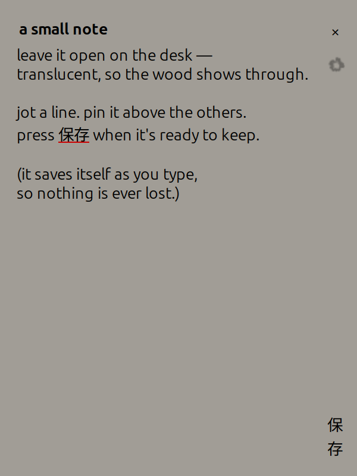

# Lace Notes

A translucent sticky-note scratchpad for the Linux desktop. It sits quietly on
your screen, lets the wallpaper show through, and saves itself as you type so a
stray thought is never lost.

<p align="center">
  
</p>

## What it does

- **Translucent, borderless window** — a soft frosted pane you can drag and resize from any edge.
- **Auto-saving draft** — everything you type is kept in `~/.cache/lace-notes-draft.json`, so closing and reopening picks up exactly where you left off.
- **保存 to keep** — press the vertical *save* button and the note is written to `~/Documents/Lace Notes/` as a Markdown file, titled from its heading.
- **Pin on top** — the flower toggles keep-above so the note floats over your other windows.
- **Drop in images** — drag an image file, a URL, or a picture from your browser straight into the note; it's embedded inline and saved alongside the Markdown.
- **Spell check** as you type (via GSpell).

## Requirements

- Python 3
- GTK 3 with GObject Introspection
- GSpell (`gspell` / `Gspell-1` typelib)

On Debian/Ubuntu:

```bash
sudo apt install python3-gi gir1.2-gtk-3.0 gir1.2-gspell-1
```

## Run

```bash
python3 lace-notes.py
```

The flower icon in `assets/` is used as the window and app icon.

## Install as a desktop app (optional)

Clone into `~/Projects/lace-notes`, then link the launcher so it shows up in
your applications menu:

```bash
cp lace-notes.desktop ~/.local/share/applications/
```

The provided `.desktop` uses `%h` (your home directory), so it resolves without
editing as long as the repo lives at `~/Projects/lace-notes`. To have it open at
login, copy the same file into `~/.config/autostart/`.

## Notes

- Saved notes go to `~/Documents/Lace Notes/`, with any embedded images in an
  `images/` subfolder beside them.
- The window is undecorated: drag the thin bar at the top to move it, drag any
  edge or corner to resize.

---

Made with care. 🤍
